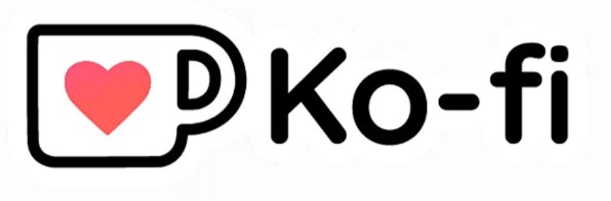

<div align="center">
  <!-- Reemplaza 'banner.png' con la ruta real de tu imagen -->
  
</div>

# StoryScore
**StoryScore** es un plugin para Obsidian diseñado para compositores, directores de audio, escritores y creadores que necesitan organizar y gestionar bandas sonoras, pistas y leitmotifs directamente en su bóveda, conectando el proceso narrativo con el musical.

Un registro ordenado de ideas musicales, versiones de mezcla y motivos recurrentes (leitmotifs) suele requerir múltiples aplicaciones externas u hojas de cálculo desordenadas. **StoryScore** resuelve esto permitiéndote vincular archivos de audio, letras y notas directamente a tus proyectos en Obsidian. Mantén toda la información conceptual y técnica en el mismo lugar donde escribes tu historia o documento de diseño.


## Características de la versión actual

- **Gestor Principal (Manager):** Una vista unificada para ver, reproducir y filtrar todas tus bandas sonoras y pistas.
- **Tarjetas de Pistas (Track Cards):** Reproductor integrado de audio con visualización rápida de metadatos.
- **Creación de Bandas Sonoras:** Define álbumes o proyectos musicales generales.
- **Gestión de Pistas:** Añade pistas con atributos personalizables como estado, tipo, letras y selección de archivos de audio locales.
- **Sistema de Leitmotifs:** Registra y conecta motivos musicales con personajes, objetos o lugares, detallando anotaciones musicales.
- **Bloques de código interactivos:** Incrusta tarjetas de pistas directamente en cualquier nota usando un bloque de código `storyscore`. ¡Ideal para fichas de personajes o escenas!


### Manager (Gestor Principal)
Vista centralizada accesible desde la barra lateral (Ribbon). Filtra tus pistas por banda sonora, escucha el progreso y administra todo de un vistazo.
<div align="center">
  <!-- Reemplaza con la ruta de tu captura -->
  
</div>

### Creación de Soundtracks y Tracks
Crea pistas y leitmotifs de manera sencilla, asignando estados, tipos y vinculando archivos de audio de tu bóveda sin tener que tocar código.
<div align="center">
  <!-- Reemplaza con la ruta de tu captura -->
  
</div>

### Tarjetas Integradas (Codeblocks)

Inserta pistas directamente en el flujo de tu texto. Simplemente escribe `/storyscore` o usa el comando para generar la tarjeta jugable.
<div align="center">
  
</div>

## Estructura de carpetas

En los ajustes del plugin puedes elegir tu **Carpeta Base** (por defecto `StoryScore`). Para mantener el orden y asegurar el buen funcionamiento del plugin, StoryScore gestiona internamente la siguiente estructura:

```text
📁 Tu Carpeta Base (StoryScore)
 ├── 📁 soundtracks  (Notas de bandas sonoras)
 ├── 📁 tracks       (Notas de pistas individuales)
 └── 📁 leitmotifs   (Notas de motivos musicales)
```
## ¿Qué viene después?

El desarrollo de StoryScore apenas comienza. En futuras actualizaciones se planea construir interfaces completas de documentación y vistas interactivas para conectar de forma mucho más visual las pistas, motivos y escenas, permitiendo mapear toda la música con la narrativa de un vistazo. A su vez, se desarrollarán herramientas de trabajo cooperativo con funcionalidades diseñadas específicamente para facilitar la colaboración entre equipos de escritores, diseñadores narrativos y compositores, haciendo que sincronizar la bóveda musical sea un proceso natural y aún más intuitivo.

## Traducciones
StoryScore cuenta con traducciones completas para:
- 🇪🇸 **Español** 
- 🇬🇧 **Inglés** 

## Apóyame
Si este plugin te resulta útil para tus proyectos y quieres apoyar su desarrollo, ¡considera invitarme a un café!

<div align="center">
  <a href="https://ko-fi.com/pernax">
    <!-- Reemplaza con una captura bonita de tu Ko-fi -->
    
  </a>
  <br><br>
  <a href="https://ko-fi.com/pernax"><strong>Apóyame en Ko-fi</strong></a>
</div>
