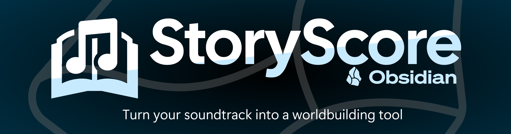
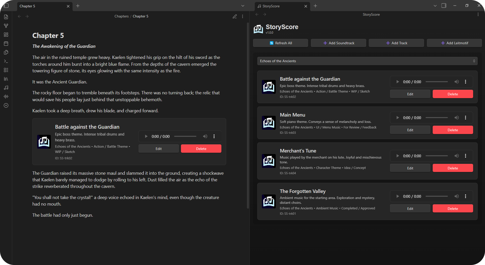
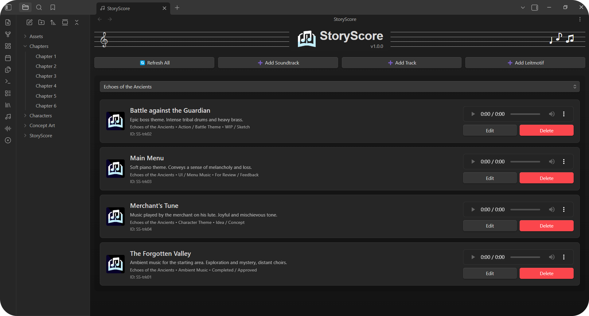
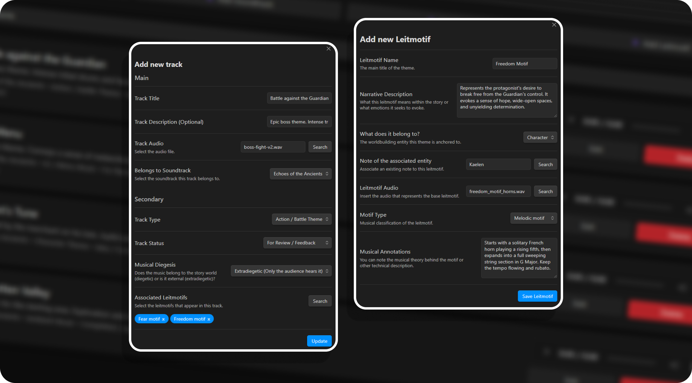
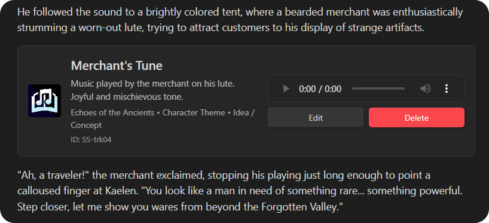

<div align="center">
  <!-- Replace 'banner.png' with your actual image path -->
  
</div>

# StoryScore
**StoryScore** is an Obsidian plugin designed for composers, audio directors, writers, and creators who need to organize and manage soundtracks, tracks, and leitmotifs directly in their vault, bridging the narrative process with the musical one.

Keeping an organized log of musical ideas, mix versions, and recurring motifs (leitmotifs) usually requires multiple external apps or messy spreadsheets. **StoryScore** solves this by letting you link audio files, lyrics, and notes directly to your Obsidian projects. Keep all conceptual and technical information in the same place where you write your story or design document.



## Current Version Features

- **Main Manager:** A unified view to see, play, and filter all your soundtracks and tracks.
- **Track Cards:** Integrated audio player with a quick display of metadata.
- **Soundtrack Creation:** Define albums or general musical projects.
- **Track Management:** Add tracks with customizable attributes like status, type, lyrics, and selection of local audio files.
- **Leitmotif System:** Log and connect musical motifs to characters, objects, or places, detailing musical annotations.
- **Interactive Codeblocks:** Embed track cards directly into any note using a `storyscore` codeblock. Perfect for character sheets or scene notes!

### Manager
A centralized view accessible from the Ribbon. Filter your tracks by soundtrack, listen to progress, and manage everything at a glance.
<div align="center">
  <!-- Replace with your screenshot path -->
  
</div>

### Creation 
Easily create tracks and leitmotifs, assign statuses and types, and link audio files from your vault without having to write any code.
<div align="center">
  <!-- Replace with your screenshot path -->
  
</div>

### Embedded Cards (Codeblocks)

Insert tracks directly into the flow of your text. Open the **Command Palette** while on the desired note and use the *Insert track player here* command. If you prefer to do it manually, create a codeblock like this:

````markdown
```storyscore
id: SS-rnf8e # (Example track ID)
```
````

This will give your notes a much more immersive musical and narrative dimension, allowing you to play the exact music for a scene, character, or event without leaving the text.
<div align="center">
  
</div>

## Folder Structure

In the plugin settings, you can choose your **Base Folder** (default is `StoryScore`). To maintain order and ensure proper plugin functionality, StoryScore internally manages the following structure:

```text
📁 Your Base Folder (StoryScore)
 ├── 📁 soundtracks  (Soundtrack notes)
 ├── 📁 tracks       (Individual track notes)
 └── 📁 leitmotifs   (Musical motif notes)
```
## What's Next?

StoryScore's development has just begun. Future updates plan to build comprehensive documentation interfaces and interactive views to connect tracks, motifs, and scenes much more visually, allowing you to map out all the music with the narrative at a glance. Additionally, cooperative workflow tools will be developed with features specifically designed to facilitate collaboration between teams of writers, narrative designers, and composers, making the synchronization of your musical vault a natural and even more intuitive process.

## Translations

Currently, StoryScore supports the following languages:
- 🇬🇧 **English**
- 🇪🇸 **Spanish**

Since music is a universal language, any help to bring StoryScore to more languages is highly appreciated!

If you want to contribute a translation:
1. **Fork** this repository.
2. Create a new language file inside the `src/locales/` folder (you can use `en.ts` as a template).
3. Submit a **Pull Request (PR)** with your translated file.

Your translation will be included in the next release, and you will be fully credited for your contribution!

## Support Me
If you find this plugin useful for your projects and want to support its development, consider buying me a coffee!  :]

<div align="center">
  
  <br>
  <strong>SrPernax</strong>
  <br><br>
  <a href="https://ko-fi.com/pernax" target="_blank">
    
  </a>
  &nbsp;&nbsp;&nbsp;
  <a href="https://github.com/SrPernax" target="_blank">
    
  </a>
</div>

<br>
<div align="center">
  Thanks for using <b>StoryScore</b>
</div>
